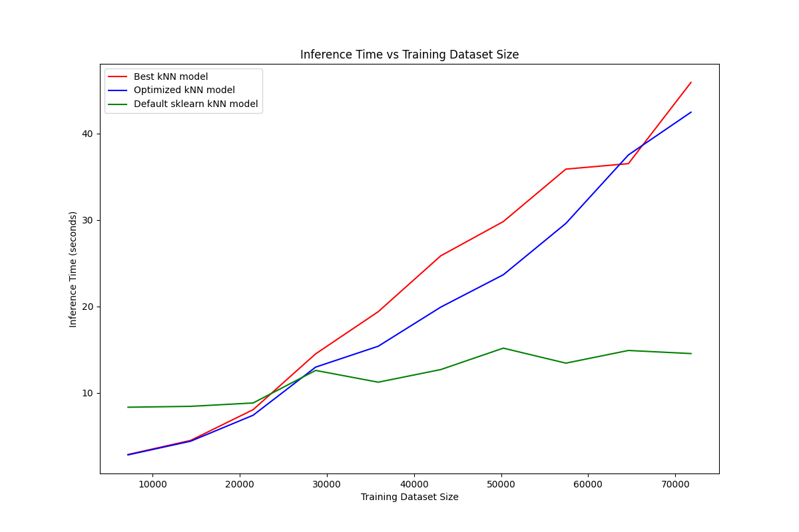

# Assignment 1 Report

### Exploratory Data Analysis:
- In have taken popularity, duration_ms, explicit, danceability, energy,key, loudness, mode, speechiness, acousticness, instrumentalness, liveness, valence, tempo, time_signature, track_genre as features.

- I have plotted histogram for all these features, box plot for all the features except binary features, scatter plot for some selected pair of features.

- From this analysis we can say that some features have better distribution along different values relative to others.

### Hyperparamter Tuning:
- I found manhattan as best distance metric in terms of performance.I ran the knn model for k = 10, 20 ... 250 with distance metric as manhattan and found that accuracy decreases as k increases after k = 50
- I ran knn for k from 1 to 50. I got following best {k, distance metric} pairs.
- I tried dropping various coloumn and got best results with dropping features 'explicit' and 'time_signature'.

### Optimization:
- I ran three kNN model variants - best KNN model(with best {k, distance metric} pair), most optimized KNN model, default sklearn KNN model.
- Following plot shows inference time for these three models.

- Following plot show inference time vs Dataset size for these three models.

- From these plots we can say that for large datasize default sklearn model performs better.

### Performance of Spotify-2
- I got following results
 >  **For Train Data :**   
 >  Accuracy : 0.26336669371562527  
 >  Precision (macro) : 0.002678084882240224   
 >  Recall (macro): 0.002518493984940468  
 >  F1-Score (macro): 0.002678084882240224  
 >  Precision (micro) : 0.26336669371562527  
 >  Recall (micro): 0.26336669371562527  
 >  F1-Score (micro): 0.26336669371562527  
 > **For Test Data :**  
 >  Accuracy : 0.25345247766043866  
 >  Precision (macro) : 0.0025961410990731106  
 >  Recall (macro): 0.0024391921932479035  
 >  F1-Score (macro): 0.0025961410990731106  
 >  Precision (micro) : 0.25345247766043866  
 >  Recall (micro): 0.25345247766043866  
 >  F1-Score (micro): 0.25345247766043866  
### Simple regression (degree = 1)
- After running on given dataset I got following results.

### Simple regression (degree > 1)
- After running on given dataset I got following results.
- Following is the curve fitting animation for k = 1

- Following is the curve fitting animation for k = 10

### Regularization
- I Tried fitting 10, 12, 17, 20 degree polynomial on given dataset.I got following result for degree 20.

- After applying L1 regularization I got following result.

- After applying L2 regularization I got following result.

- From Observations of above plots there is difference occurs in the curve fitting after applying regullarization and MSE decreases. From the analysis I can say that L1 regularization performs better that L2 regularization.