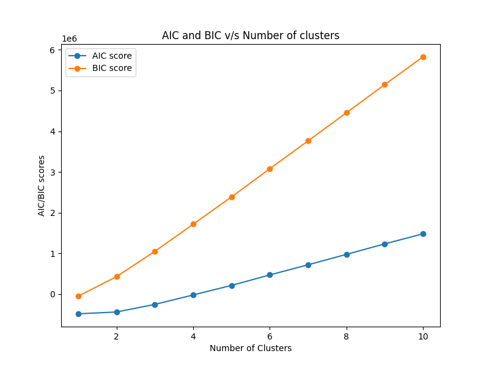

# Assignment-2 Report
### Name : Jayesh Rajesh Sutar
### Roll No. : 2022101001

## 1. K-Means Clustering
- I have Implemented the required class in models/k_means.py.I used elbow method to determine optimal number of clusters for given dataset.
- Following plot shows Within-Cluster Sum of Squares(WCSS) for different number of clusters.
 
Figure : WCSS v/s Number of Clusters       
- By Observing the plot I got optimal number of clusters as 7.So **kkmeans1 = 7**.I got following clusters

### Clusters (For **kkmeans1**)

#### Cluster 1:
deer, panda, ape, helicopter, cat, carrot, bear, spider, shark, grass, giraffe, forest, lizard, frog, fly, lake, monkey, cow, starfish, plant, puppy, pear, peacock, fish, saturn, fruit, grape, mouse, ant, goldfish, bird, spiderman, bee, beetle, snake, airplane, tomato, dragonfly, butterfly, elephant, windmill, crocodile

---

#### Cluster 2:
sing, listen, flame, sit, knock, smile, bury, download, eat, hard, fight, call, catch, hit, paint, far, dig, cry, run, clap, pull, sleep, clean, sad, slide, drink, draw, pray, arrest, email, buy, burn, fire, close, angry, lazy, scary, hang, book, earth, enter, happy, loud, love, cook, recycle, cut

---

#### Cluster 3:
table, gym, roof, bed, microwave, van, sweater, jacket, bench, sun, boat, chair, candle, igloo, clock, oven, pillow, tree, tank, ambulance, pizza, television, throne, tent, camera, car, lantern, pant, stove, wheel, truck

---

#### Cluster 4:
fishing, baseball, basket, badminton, basketball

---

#### Cluster 5:
mug, postcard, passport, notebook, microphone, bucket, laptop, calendar, calculator, envelope, tattoo, fingerprints, dustbin, loudspeaker, telephone, toaster, potato, keyboard, radio, suitcase

---

#### Cluster 6:
eraser, brush, feather, spoon, pencil, scissor, hammer, toothbrush, screwdriver, teaspoon, parachute, toothpaste, comb, fork, paintbrush

---

#### Cluster 7:
drive, rose, dive, needle, exit, brick, bullet, bend, puppet, face, climb, kneel, scream, kiss, selfie, stairs, rifle, knit, cigarette, hollow, feet, empty, flute, door, ladder, finger, skate, length, rain, key, swim, zip, sword, rainy, knife, bicycle, arrow, shoe, walk, sunny

## 2. Guassian Mixture Models
- I have Implemented the required class in models/gmm.py.
- I performed GMM clustering using gmm class written by me as well as gmm class from sklearn library. 
- My gmm class worked for given dataset because I handle the issue of zero determinant of covariance matrix by adding small values to it's diagonal which ensures invertibility of covariance matrix which is essential for multivariate normal distribution.
- Also I have logorithm of values and logrithmic probabilities to avoid problems with underflow and to ensure numerical stability.
- GaussianMixture class from sklearn library also use similar approach to avoid singularity(zero determinant of covariance matrix). 
- I used Bayesian Information Criterian(BIC) and Akaike Information Criterion(AIC) to determine optimal number of clusters.
$$ AIC = 2k - 2log(L) $$
$$ BIC = klog(N) - 2log(L) $$
- where k = Number of parameter in the model, N = Number of Observations, L = Maximum value of likelihood.
- Following plot shows AIC and BIC value for different number of clusters. 
- In case of GMM the Total number of parameters are depends on mean, covariances and mixing coefficients. 
$$ Total Parameters = kf + \frac{kf(f + 1)}{2} + (k - 1)  $$
- where k = Number of clusters and f = Number of features(Dimension of feature vector)      
   
Figure : AIC,BIC v/s Number of Clusters
- by observing above plot I got optimal number of clusters equal to 2. So **kgmm1 = 2**

### Clusters (For **kgmm1**)
#### Cluster 0: 
sing, deer, panda, ape, dive, helicopter, sit, cat, table, carrot, smile, bear, spider, shark, giraffe, mug, eat, spoon, bend, frog, puppet, gym, lake, climb, kneel, scream, monkey, kiss, selfie, roof, stairs, rifle, cow, pencil, bed, starfish, paint, plant, dig, run, clap, van, sweater, microphone, jacket, sun, bucket, puppy, clean, feet, pear, sad, peacock, saturn, flute, fruit, scissor, grape, badminton, chair, ladder, finger, ant, igloo, goldfish, spiderman, bee, angry, tree, beetle, hammer, toothbrush, tattoo, fingerprints, teaspoon, length, rain, tank, airplane, swim, camera, zip, tomato, parachute, car, lantern, elephant, pant, stove, rainy, knife, toothpaste, windmill, potato, comb, crocodile, fork

---

#### Cluster 1:
drive, listen, rose, flame, knock, needle, eraser, exit, brick, fishing, bullet, grass, bury, download, forest, lizard, brush, feather, postcard, hard, fight, call, fly, face, passport, catch, hit, far, microwave, cry, notebook, pull, sleep, knit, cigarette, baseball, hollow, bench, boat, basket, empty, fish, slide, drink, laptop, door, draw, calendar, mouse, pray, arrest, email, candle, buy, bird, clock, oven, calculator, burn, pillow, fire, close, lazy, scary, hang, envelope, skate, book, screwdriver, snake, earth, dustbin, ambulance, pizza, enter, television, throne, key, tent, dragonfly, butterfly, sword, loudspeaker, happy, telephone, loud, love, cook, basketball, wheel, bicycle, arrow, recycle, toaster, cut, shoe, walk, keyboard, sunny, radio, truck, suitcase, paintbrush

## 3. Dimensionality Reduction using PCA
- I have Implented required class in models/pca.py. 
- I used PCA to project given data into 2 and 3 dimensions.      
        
Figure : Projection of Given Data in 2D         
        
Figure : Projection of Given Data in 3D      

- New axes obtained from PCA represents Principal components of given data. These are linear combinations of the original features.Each axes captures underlying structure of the data by maximizing variance.
- By observing 2D and 3D projections I can say there are 4 clusters possible in given dataset. So **k2 = 4**.
- we can visualize them as follows      
    
Figure : Projection of Given Data in 2D   

## 4. Clustering with PCA
- I preformed kmeans clustering using k2 = 4 and got following clusters:

### Clusters (For **k2**)

#### Cluster 1: 
drive, deer, rose, needle, carrot, brick, fishing, bear, spider, bullet, shark, grass, giraffe, forest, lizard, brush, feather, spoon, frog, puppet, lake, climb, scream, monkey, plant, knit, cigarette, baseball, bucket, puppy, boat, pear, basket, fish, saturn, flute, scissor, grape, door, badminton, mouse, finger, candle, igloo, goldfish, bird, clock, spiderman, tree, beetle, skate, hammer, toothbrush, screwdriver, snake, fingerprints, teaspoon, length, dustbin, rain, airplane, pizza, swim, dragonfly, butterfly, sword, loudspeaker, telephone, rainy, knife, toothpaste, basketball, wheel, bicycle, windmill, arrow, comb, shoe, walk, fork, truck, paintbrush

---

#### Cluster 2:
sing, listen, dive, flame, knock, exit, smile, bury, download, eat, hard, bend, fight, call, fly, face, kneel, kiss, selfie, catch, hit, paint, far, cry, clap, pull, sleep, hollow, clean, sad, empty, slide, drink, draw, pray, arrest, buy, burn, fire, close, angry, lazy, scary, hang, tattoo, earth, tank, enter, key, zip, happy, loud, love, cook, recycle, cut, sunny

---

#### Cluster 3:
panda, ape, helicopter, sit, cat, eraser, table, mug, gym, roof, stairs, rifle, cow, pencil, bed, starfish, microwave, dig, run, van, sweater, microphone, jacket, bench, sun, feet, peacock, fruit, chair, ladder, ant, oven, bee, pillow, ambulance, throne, tent, tomato, parachute, car, lantern, elephant, pant, stove, toaster, potato, crocodile, suitcase. 

---

#### Cluster 4:
postcard, passport, notebook, laptop, calendar, email, calculator, envelope, book, television, camera, keyboard, radio

- I used scree plot to determine optimal number of dimensions for reduction.    
           
Figure:Scree Plot of given dataset(word Embeddings)
- I assumed that optimal dimensions retain approx 90 % variance.By observations I got optimal number of dimensions as 110.I calculate reduced dataset by projection given data to 110 dimensions.
- I used elbow Method on reduced dataset to determine optimal number of clusters for kMeans clustering algorithm.   
          
Figure : WCSS v/s Number of Clusters for Reduced Dataset
- By observing above plot I got optimal number of clusters equal to 8 So, **kkmeans3 = 8**. I got following clusters using kmeans.
### Clusters (For **kkmeans3**)

#### Cluster 1: 
listen, flame, knock, bury, download, hard, fight, call, hit, far, cry, sleep, clean, slide, pray, arrest, email, burn, fire, close, angry, lazy, scary, hang, enter, happy, loud, love, recycle, cut

---

#### Cluster 2: 
deer, helicopter, fishing, bear, spider, shark, grass, giraffe, forest, lizard, frog, puppet, lake, monkey, starfish, plant, knit, sweater, feet, pear, peacock, saturn, fruit, grape, mouse, ant, goldfish, bird, spiderman, tree, beetle, snake, airplane, dragonfly, parachute, butterfly, elephant, crocodile

---

#### Cluster 3: 
needle, table, mug, roof, stairs, microwave, microphone, jacket, bench, bucket, boat, door, chair, ladder, candle, igloo, clock, oven, pillow, envelope, dustbin, ambulance, throne, tent, loudspeaker, lantern, telephone, stove, wheel, windmill, toaster, suitcase

---

#### Cluster 4: 
eraser, carrot, brush, feather, spoon, flute, scissor, finger, toothbrush, screwdriver, teaspoon, length, sword, knife, toothpaste, comb, fork, paintbrush

---

#### Cluster 5: 
baseball, basket, badminton, skate, basketball, bicycle

---

#### Cluster 6: 
panda, ape, cat, gym, rifle, cow, pencil, bed, van, sun, laptop, calendar, calculator, bee, television, camera, tomato, car, potato.

---

#### Cluster 7: 
drive, sing, rose, dive, exit, brick, smile, bullet, postcard, bend, fly, face, climb, kneel, scream, kiss, passport, selfie, catch, paint, notebook, pull, cigarette, hollow, puppy, empty, fish, drink, draw, hammer, book, tattoo, earth, fingerprints, rain, tank, pizza, key, swim, zip, rainy, cook, arrow, shoe, walk, keyboard, sunny, radio, truck.

---

#### Cluster 8: 
microwave, toothbrush, dustbin, tomato, toothpaste, toaster, paintbrush.

- I performed GMM clustering using k2=4 and got following clusters:
### Clusters (For **k2**)

#### Cluster 1: 
deer, panda, ape, helicopter, cat, smile, gym, face, monkey, stairs, rifle, cow, bed, starfish, microwave, pull, van, baseball, jacket, bench, sun, boat, peacock, fruit, chair, ladder, arrest, ant, calculator, bee, tree, snake, airplane, ambulance, television, throne, tent, camera, tomato, parachute, butterfly, car, lantern, telephone, elephant, pant, stove, basketball, wheel, bicycle, windmill, potato, cut, crocodile, radio, truck, suitcase 

---
#### Cluster 2: 
drive, sing, dive, flame, sit, exit, fishing, bear, shark, hard, bend, frog, fight, fly, lake, climb, kneel, kiss, catch, hit, plant, far, dig, run, clap, sleep, puppy, clean, sad, empty, fish, slide, drink, pray, buy, bird, oven, spiderman, fire, close, lazy, hang, skate, earth, rain, tank, enter, swim, love, rainy, sunny

---
#### Cluster 3: 
rose, needle, eraser, carrot, spider, bullet, giraffe, lizard, brush, mug, feather, eat, spoon, puppet, scream, pencil, knit, sweater, microphone, hollow, feet, pear, saturn, flute, scissor, grape, badminton, mouse, finger, candle, igloo, goldfish, pillow, beetle, hammer, toothbrush, screwdriver, fingerprints, teaspoon, length, pizza, zip, dragonfly, sword, knife, toothpaste, arrow, comb, shoe, fork, paintbrush. 

---
#### Cluster 4: 
listen, knock, table, brick, grass, bury, download, forest, postcard, call, passport, selfie, roof, paint, cry, notebook, cigarette, bucket, basket, laptop, door, draw, calendar, email, clock, burn, angry, scary, envelope, book, tattoo, dustbin, key, loudspeaker, happy, loud, cook, recycle, toaster, walk, keyboard

---

- Similarly I used AIC and BIC to determine optimal number of clusters in GMM for reduced dataset.  
    
Figure : AIC and BIC v/s Number of Clusters
- By observing above plot I got optimal number of clusters equal to 5 So, **kgmm3 = 5**. I got following clusters:
### Clusters (For **kgmm3**)

#### Cluster 1: 
needle, eraser, carrot, lizard, brush, feather, spoon, passport, stairs, pencil, cigarette, scissor, grape, candle, toothbrush, teaspoon, length, dustbin, airplane, throne, tomato, sword, elephant, pant, knife, toothpaste, potato, comb, crocodile, shoe, fork, paintbrush

---
#### Cluster 2: 
deer, panda, ape, rose, bear, bullet, grass, giraffe, forest, frog, climb, monkey, roof, cow, plant, feet, peacock, fruit, bee, tree, earth, rain, tent, butterfly, car, rainy, sunny

---
#### Cluster 3: 
listen, flame, sit, knock, exit, brick, smile, spider, bury, download, eat, postcard, hard, bend, fight, puppet, call, fly, face, kneel, scream, selfie, hit, paint, far, dig, cry, notebook, run, clap, pull, sleep, hollow, puppy, clean, sad, empty, slide, drink, draw, pray, arrest, email, buy, burn, fire, close, angry, lazy, scary, hang, hammer, book, snake, tank, enter, key, zip, happy, loud, love, cook, recycle, cut, truck

---
#### Cluster 4: 
drive, sing, dive, helicopter, cat, fishing, shark, gym, lake, kiss, rifle, catch, starfish, knit, baseball, jacket, bench, boat, basket, fish, flute, calendar, badminton, ladder, goldfish, bird, spiderman, skate, tattoo, swim, dragonfly, lantern, basketball, bicycle, arrow, walk

---
#### Cluster 5: 
table, mug, bed, microwave, van, sweater, microphone, sun, bucket, pear, saturn, laptop, door, chair, mouse, finger, ant, igloo, clock, oven, calculator, pillow, beetle, envelope, screwdriver, fingerprints, ambulance, pizza, television, camera, parachute, loudspeaker, telephone, stove, wheel, windmill, toaster, keyboard, radio, suitcase

## 5. Cluster Analysis

## k-Means Cluster Anaylsis
### Clusters (For **kkmeans1**)

#### Cluster 1:
deer, panda, ape, helicopter, cat, carrot, bear, spider, shark, grass, giraffe, forest, lizard, frog, fly, lake, monkey, cow, starfish, plant, puppy, pear, peacock, fish, saturn, fruit, grape, mouse, ant, goldfish, bird, spiderman, bee, beetle, snake, airplane, tomato, dragonfly, butterfly, elephant, windmill, crocodile

---
Most of the words are part of natural world there are some exception of some words like 'airplane' and 'spiderman'.

#### Cluster 2:
sing, listen, flame, sit, knock, smile, bury, download, eat, hard, fight, call, catch, hit, paint, far, dig, cry, run, clap, pull, sleep, clean, sad, slide, drink, draw, pray, arrest, email, buy, burn, fire, close, angry, lazy, scary, hang, book, earth, enter, happy, loud, love, cook, recycle, cut

---
All items represents actions or emotions.It represents elements that are closely related to human behaviour.

#### Cluster 3:
table, gym, roof, bed, microwave, van, sweater, jacket, bench, sun, boat, chair, candle, igloo, clock, oven, pillow, tree, tank, ambulance, pizza, television, throne, tent, camera, car, lantern, pant, stove, wheel, truck

---
Cluster represents household objects. these items belongs to settings where people live or work.

#### Cluster 4:
fishing, baseball, basket, badminton, basketball

---
This cluster represents sports-related objects.

#### Cluster 5:
mug, postcard, passport, notebook, microphone, bucket, laptop, calendar, calculator, envelope, tattoo, fingerprints, dustbin, loudspeaker, telephone, toaster, potato, keyboard, radio, suitcase

---
This cluster contains objects related to office or home or related to communications purpose.

#### Cluster 6:
eraser, brush, feather, spoon, pencil, scissor, hammer, toothbrush, screwdriver, teaspoon, parachute, toothpaste, comb, fork, paintbrush

---
This cluster contains all handheld objects used for different activities

#### Cluster 7:
drive, rose, dive, needle, exit, brick, bullet, bend, puppet, face, climb, kneel, scream, kiss, selfie, stairs, rifle, knit, cigarette, hollow, feet, empty, flute, door, ladder, finger, skate, length, rain, key, swim, zip, sword, rainy, knife, bicycle, arrow, shoe, walk, sunny

This cluster contains more random words some parts represents actions while some represents body parts and other random words like 'puppet'.

### Clusters (For **k2**)

#### Cluster 1: 
drive, deer, rose, needle, carrot, brick, fishing, bear, spider, bullet, shark, grass, giraffe, forest, lizard, brush, feather, spoon, frog, puppet, lake, climb, scream, monkey, plant, knit, cigarette, baseball, bucket, puppy, boat, pear, basket, fish, saturn, flute, scissor, grape, door, badminton, mouse, finger, candle, igloo, goldfish, bird, clock, spiderman, tree, beetle, skate, hammer, toothbrush, screwdriver, snake, fingerprints, teaspoon, length, dustbin, rain, airplane, pizza, swim, dragonfly, butterfly, sword, loudspeaker, telephone, rainy, knife, toothpaste, basketball, wheel, bicycle, windmill, arrow, comb, shoe, walk, fork, truck, paintbrush

---
This cluster contains words with diverse themes.There are animals,objects, some everyday objects. 

#### Cluster 2:
sing, listen, dive, flame, knock, exit, smile, bury, download, eat, hard, bend, fight, call, fly, face, kneel, kiss, selfie, catch, hit, paint, far, cry, clap, pull, sleep, hollow, clean, sad, empty, slide, drink, draw, pray, arrest, buy, burn, fire, close, angry, lazy, scary, hang, tattoo, earth, tank, enter, key, zip, happy, loud, love, cook, recycle, cut, sunny

---
The cluster is meaningful as it focuses on verbs and adjectives related to human activities, emotions, and states.

#### Cluster 3:
panda, ape, helicopter, sit, cat, eraser, table, mug, gym, roof, stairs, rifle, cow, pencil, bed, starfish, microwave, dig, run, van, sweater, microphone, jacket, bench, sun, feet, peacock, fruit, chair, ladder, ant, oven, bee, pillow, ambulance, throne, tent, tomato, parachute, car, lantern, elephant, pant, stove, toaster, potato, crocodile, suitcase. 

---
This cluster contains some living creatures but contains other random words.

#### Cluster 4:
postcard, passport, notebook, laptop, calendar, email, calculator, envelope, book, television, camera, keyboard, radio

This cluster contains items related to office work and communication.

### Clusters (For **kkmeans3**)

#### Cluster 1: 
listen, flame, knock, bury, download, hard, fight, call, hit, far, cry, sleep, clean, slide, pray, arrest, email, burn, fire, close, angry, lazy, scary, hang, enter, happy, loud, love, recycle, cut

---
This cluster focuses on verbs and adjectives related to emotional and physical states.  

#### Cluster 2: 
deer, helicopter, fishing, bear, spider, shark, grass, giraffe, forest, lizard, frog, puppet, lake, monkey, starfish, plant, knit, sweater, feet, pear, peacock, saturn, fruit, grape, mouse, ant, goldfish, bird, spiderman, tree, beetle, snake, airplane, dragonfly, parachute, butterfly, elephant, crocodile

---
This cluster contains animals and nature-related items.

#### Cluster 3: 
needle, table, mug, roof, stairs, microwave, microphone, jacket, bench, bucket, boat, door, chair, ladder, candle, igloo, clock, oven, pillow, envelope, dustbin, ambulance, throne, tent, loudspeaker, lantern, telephone, stove, wheel, windmill, toaster, suitcase

---
This contains wide range of objects used in daily life with some outliers.

#### Cluster 4: 
eraser, carrot, brush, feather, spoon, flute, scissor, finger, toothbrush, screwdriver, teaspoon, length, sword, knife, toothpaste, comb, fork, paintbrush

---
This contains personal items and tools with some outliers. 

#### Cluster 5: 
baseball, basket, badminton, skate, basketball, bicycle

---
This cluster contains words related to sports.

#### Cluster 6: 
panda, ape, cat, gym, rifle, cow, pencil, bed, van, sun, laptop, calendar, calculator, bee, television, camera, tomato, car, potato.

---
This contains diverse words with different themes.

#### Cluster 7: 
drive, sing, rose, dive, exit, brick, smile, bullet, postcard, bend, fly, face, climb, kneel, scream, kiss, passport, selfie, catch, paint, notebook, pull, cigarette, hollow, puppy, empty, fish, drink, draw, hammer, book, tattoo, earth, fingerprints, rain, tank, pizza, key, swim, zip, rainy, cook, arrow, shoe, walk, keyboard, sunny, radio, truck.

---
This contains diverse words related to actions, emotions, objects and activities.

#### Cluster 8: 
microwave, toothbrush, dustbin, tomato, toothpaste, toaster, paintbrush.

This contains items related to kitchen or personal care so all are household items.

- Overall by comparing coherence and meaningfulness with k=k2 we are getting more outliers which results lower interclass similarity.While k=kmean3 also contains random words b/w some clusters.With k=kmeans1 we are getting more relatable clusters.So we can say that k_kmeans1 is best. **kkmeans**=**kkmeans1**=7

## GMM Cluster Anaylsis
### Clusters (For **kgmm1**)
#### Cluster 0: 
sing, deer, panda, ape, dive, helicopter, sit, cat, table, carrot, smile, bear, spider, shark, giraffe, mug, eat, spoon, bend, frog, puppet, gym, lake, climb, kneel, scream, monkey, kiss, selfie, roof, stairs, rifle, cow, pencil, bed, starfish, paint, plant, dig, run, clap, van, sweater, microphone, jacket, sun, bucket, puppy, clean, feet, pear, sad, peacock, saturn, flute, fruit, scissor, grape, badminton, chair, ladder, finger, ant, igloo, goldfish, spiderman, bee, angry, tree, beetle, hammer, toothbrush, tattoo, fingerprints, teaspoon, length, rain, tank, airplane, swim, camera, zip, tomato, parachute, car, lantern, elephant, pant, stove, rainy, knife, toothpaste, windmill, potato, comb, crocodile, fork

---
This cluster contains words with various such as animals, objects, activities. some words have connection but overall the cluster contains wide range of items.

#### Cluster 1:
drive, listen, rose, flame, knock, needle, eraser, exit, brick, fishing, bullet, grass, bury, download, forest, lizard, brush, feather, postcard, hard, fight, call, fly, face, passport, catch, hit, far, microwave, cry, notebook, pull, sleep, knit, cigarette, baseball, hollow, bench, boat, basket, empty, fish, slide, drink, laptop, door, draw, calendar, mouse, pray, arrest, email, candle, buy, bird, clock, oven, calculator, burn, pillow, fire, close, lazy, scary, hang, envelope, skate, book, screwdriver, snake, earth, dustbin, ambulance, pizza, enter, television, throne, key, tent, dragonfly, butterfly, sword, loudspeaker, happy, telephone, loud, love, cook, basketball, wheel, bicycle, arrow, recycle, toaster, cut, shoe, walk, keyboard, sunny, radio, truck, suitcase, paintbrush

This also contains wide range of words belongs to different themes.So some connections are possible but overall low coherence

### Clusters (For **k2**)

#### Cluster 1: 
deer, panda, ape, helicopter, cat, smile, gym, face, monkey, stairs, rifle, cow, bed, starfish, microwave, pull, van, baseball, jacket, bench, sun, boat, peacock, fruit, chair, ladder, arrest, ant, calculator, bee, tree, snake, airplane, ambulance, television, throne, tent, camera, tomato, parachute, butterfly, car, lantern, telephone, elephant, pant, stove, basketball, wheel, bicycle, windmill, potato, cut, crocodile, radio, truck, suitcase 

---
This contains diverse range of objects.

#### Cluster 2: 
drive, sing, dive, flame, sit, exit, fishing, bear, shark, hard, bend, frog, fight, fly, lake, climb, kneel, kiss, catch, hit, plant, far, dig, run, clap, sleep, puppy, clean, sad, empty, fish, slide, drink, pray, buy, bird, oven, spiderman, fire, close, lazy, hang, skate, earth, rain, tank, enter, swim, love, rainy, sunny

---
This contains actions and verbs with some relatable nouns.

#### Cluster 3: 
rose, needle, eraser, carrot, spider, bullet, giraffe, lizard, brush, mug, feather, eat, spoon, puppet, scream, pencil, knit, sweater, microphone, hollow, feet, pear, saturn, flute, scissor, grape, badminton, mouse, finger, candle, igloo, goldfish, pillow, beetle, hammer, toothbrush, screwdriver, fingerprints, teaspoon, length, pizza, zip, dragonfly, sword, knife, toothpaste, arrow, comb, shoe, fork, paintbrush. 

---
This contains various tools but also contains other diverse words.

#### Cluster 4: 
listen, knock, table, brick, grass, bury, download, forest, postcard, call, passport, selfie, roof, paint, cry, notebook, cigarette, bucket, basket, laptop, door, draw, calendar, email, clock, burn, angry, scary, envelope, book, tattoo, dustbin, key, loudspeaker, happy, loud, cook, recycle, toaster, walk, keyboard

---
This contains items with everyday context with actions and emotions.

### Clusters (For **kgmm3**)

#### Cluster 1: 
needle, eraser, carrot, lizard, brush, feather, spoon, passport, stairs, pencil, cigarette, scissor, grape, candle, toothbrush, teaspoon, length, dustbin, airplane, throne, tomato, sword, elephant, pant, knife, toothpaste, potato, comb, crocodile, shoe, fork, paintbrush

---
This contains items with diverse range of themes.
#### Cluster 2: 
deer, panda, ape, rose, bear, bullet, grass, giraffe, forest, frog, climb, monkey, roof, cow, plant, feet, peacock, fruit, bee, tree, earth, rain, tent, butterfly, car, rainy, sunny

---
This contains words related to nature, animals and weather.
#### Cluster 3: 
listen, flame, sit, knock, exit, brick, smile, spider, bury, download, eat, postcard, hard, bend, fight, puppet, call, fly, face, kneel, scream, selfie, hit, paint, far, dig, cry, notebook, run, clap, pull, sleep, hollow, puppy, clean, sad, empty, slide, drink, draw, pray, arrest, email, buy, burn, fire, close, angry, lazy, scary, hang, hammer, book, snake, tank, enter, key, zip, happy, loud, love, cook, recycle, cut, truck

---
This contains wide range of activities and emotions and other themes.

#### Cluster 4: 
drive, sing, dive, helicopter, cat, fishing, shark, gym, lake, kiss, rifle, catch, starfish, knit, baseball, jacket, bench, boat, basket, fish, flute, calendar, badminton, ladder, goldfish, bird, spiderman, skate, tattoo, swim, dragonfly, lantern, basketball, bicycle, arrow, walk

---
This focus on activities, sports but there are some animals.

#### Cluster 5: 
table, mug, bed, microwave, van, sweater, microphone, sun, bucket, pear, saturn, laptop, door, chair, mouse, finger, ant, igloo, clock, oven, calculator, pillow, beetle, envelope, screwdriver, fingerprints, ambulance, pizza, television, camera, parachute, loudspeaker, telephone, stove, wheel, windmill, toaster, keyboard, radio, suitcase

This contains pratical objects and tools used in daily life.

- Overall by comparing coherence and meaningfulness k=kgmm1 and k=k2 lacks interclass similarity and contains more outliers.I can say that k=gmm3 performs best in all three.**kgmm**=**kgmm3**=5

## Comparision between Kmeans and GMMs
- By looking at the clustering of **kgmm** and **kkmeans** we can see that **kkmeans performs better that kgmm** due to better interclass similarity,meaningfulness and separation b/w different clusters.

## 6. Hierarchical Clustering 
- I performed hierarchical clustering on given dataset.I used different combination of linkage methods and distance metrics.I got following plots.  
         
Figure : Linkage Method=Average and Distance Metric=Cosine
         
Figure : Linkage Method=Complete and Distance Metric=Cosine
         
Figure : Linkage Method=Single and Distance Metric=Cosine
         
Figure : Linkage Method=Weighted and Distance Metric=Cosine
         
Figure : Linkage Method=Average and Distance Metric=Euclidean
         
Figure : Linkage Method=Centroid and Distance Metric=Euclidean
         
Figure : Linkage Method=Complete and Distance Metric=Euclidean
         
Figure : Linkage Method=Median and Distance Metric=Euclidean
         
Figure : Linkage Method=Single and Distance Metric=Euclidean
         
Figure : Linkage Method=Ward and Distance Metric=Euclidean
         
Figure : Linkage Method=Weighted and Distance Metric=Euclidean
         
Figure : Linkage Method=Average and Distance Metric=Minkowski
         
Figure : Linkage Method=Complete and Distance Metric=Minkowski
         
Figure : Linkage Method=Single and Distance Metric=Minkowski
         
Figure : Linkage Method=Weighted and Distance Metric=Minkowski
- by observing above plots I can say that euclidean distance metric with ward as linkage method performs best as it shows separated clusters, there are clear horizontal lines where we can cut dendrogram to form clusters.
- I cut dendrogram (with euclidean,ward as distance metric and linkage method) at kbest1=7 and kbest1=5 and got following clustering.
### Clusters (For **kbest1**)

#### Cluster 1: 
sing, listen, dive, flame, knock, exit, brick, smile, bury, download, hard, bend, fight, face, scream, kiss, selfie, catch, hit, paint, far, cry, sleep, hollow, clean, sad, empty, slide, drink, door, draw, pray, arrest, buy, burn, fire, close, angry, lazy, scary, hang, tattoo, earth, enter, key, swim, happy, loud, love, cook, cut

---

#### Cluster 2: 
deer, spider, shark, giraffe, lizard, feather, frog, fly, starfish, peacock, fish, ant, goldfish, bird, spiderman, bee, beetle, snake, dragonfly, butterfly, crocodile

---
#### Cluster 3: 
panda, ape, sit, cat, eraser, carrot, bear, grass, forest, eat, puppet, gym, kneel, monkey, cow, pencil, plant, dig, run, clap, pull, sun, puppy, feet, pear, fruit, grape, finger, tree, fingerprints, rain, zip, tomato, elephant, pant, rainy, potato, shoe, sunny

---
#### Cluster 4: 
brush, spoon, scissor, hammer, toothbrush, screwdriver, teaspoon, length, sword, knife, toothpaste, comb, fork, paintbrush

---
#### Cluster 5: 
table, mug, climb, roof, stairs, bed, knit, sweater, jacket, bench, bucket, chair, ladder, candle, igloo, clock, pillow, throne, tent, parachute, lantern, wheel, windmill

---
#### Cluster 6: 
drive, rose, helicopter, needle, fishing, bullet, lake, rifle, van, cigarette, baseball, boat, basket, saturn, flute, badminton, mouse, skate, tank, airplane, ambulance, pizza, car, basketball, bicycle, arrow, walk, truck

---
#### Cluster 7: 
postcard, call, passport, microwave, notebook, microphone, laptop, calendar, email, oven, calculator, envelope, book, dustbin, television, camera, loudspeaker, telephone, stove, recycle, toaster, keyboard, radio, suitcase

## Clusters (For **kbest2**)

#### Cluster 1: 
sing, listen, dive, flame, knock, exit, brick, smile, bury, download, hard, bend, fight, face, scream, kiss, selfie, catch, hit, paint, far, cry, sleep, hollow, clean, sad, empty, slide, drink, door, draw, pray, arrest, buy, burn, fire, close, angry, lazy, scary, hang, tattoo, earth, enter, key, swim, happy, loud, love, cook, cut

---

#### Cluster 2: 
deer, spider, shark, giraffe, lizard, feather, frog, fly, starfish, peacock, fish, ant, goldfish, bird, spiderman, bee, beetle, snake, dragonfly, butterfly, crocodile

---
#### Cluster 3: 
panda, ape, sit, cat, eraser, carrot, bear, grass, forest, eat, puppet, gym, kneel, monkey, cow, pencil, plant, dig, run, clap, pull, sun, puppy, feet, pear, fruit, grape, finger, tree, fingerprints, rain, zip, tomato, elephant, pant, rainy, potato, shoe, sunny

---
#### Cluster 4: 
brush, spoon, scissor, hammer, toothbrush, screwdriver, teaspoon, length, sword, knife, toothpaste, comb, fork, paintbrush

---
#### Cluster 5: 
drive, rose, helicopter, needle, table, fishing, bullet, mug, postcard, call, lake, climb, passport, roof, stairs, rifle, bed, microwave, notebook, knit, van, sweater, cigarette, microphone, baseball, jacket, bench, bucket, boat, basket, saturn, flute, laptop, calendar, badminton, chair, mouse, ladder, email, candle, igloo, clock, oven, calculator, pillow, envelope, skate, book, dustbin, tank, airplane, ambulance, pizza, television, throne, tent, camera, parachute, car, loudspeaker, lantern, telephone, stove, basketball, wheel, bicycle, windmill, arrow, recycle, toaster, walk, keyboard, radio, truck, suitcase. 

- By comparing with k-Means and GMM clustering hierarchical clustering is different in both the cases(with kbest1 and kbest2) with some minor overlap.In both cases It performs better that k-Means and GMM Clustering.

## 7. Nearest Neighbour Search with PCA
- I plot scree plot of given spotify dataset to determine optimal number of dimensions for reduction
         
Figure : Scree plot on Spotify dataset

- From this plot I got optimal numer of dimensions that can explain 90% of variance as 13.
- I project give data to 13 dimensions to create reduced dataset. I tried KNN on this reduced dataset with k=11 and distance metric as 'manhattan'. Following are the model evaluations.    

Table : Evaluation on Reduced Dataset   
| Metric              | Macro Score            | Micro Score            |   
|---------------------|------------------------|    ------------------------|   
| **Accuracy**         | -                     | 0.2817                 |      
| **Precision**        | 0.0017                 | 0.2817                 |      
| **Recall**           | 0.0016                 | 0.2817                 |  
| **F1-Score**         | 0.0017                 | 0.2817                 | 

Table : Evaluation on complete Dataset
| Metric              | Macro Score            | Micro Score            |   
|---------------------|------------------------|    ------------------------|   
| **Accuracy**         | -                     | 0.3184                 |      
| **Precision**        | 0.0018                 | 0.3184                 |      
| **Recall**           | 0.0018                 | 0.3184                 |  
| **F1-Score**         | 0.0018                 | 0.3184                 | 

- by observing the evaluation scores we can see that accuracy is slightly higher on complete dataset as model performes better where all features are retained.PCA results in loss of some information leading to slightly lesser accuracy. 
- I plot Inference time of KNN model on completed and reduced dataset.I got following plot.
      
Figure : Inference Time of KNN model for complete and reduced dataset  
- From this plot we can see that KNN takes less time for prediction using reduced dataset as compared to complete dataset because we are using less number of features.

