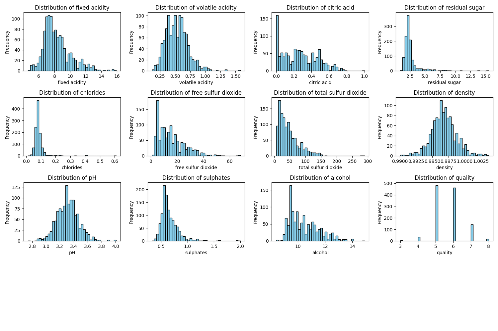
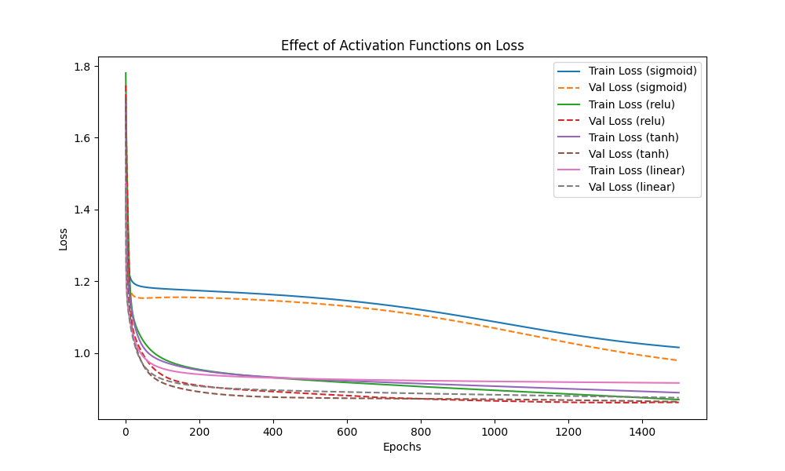
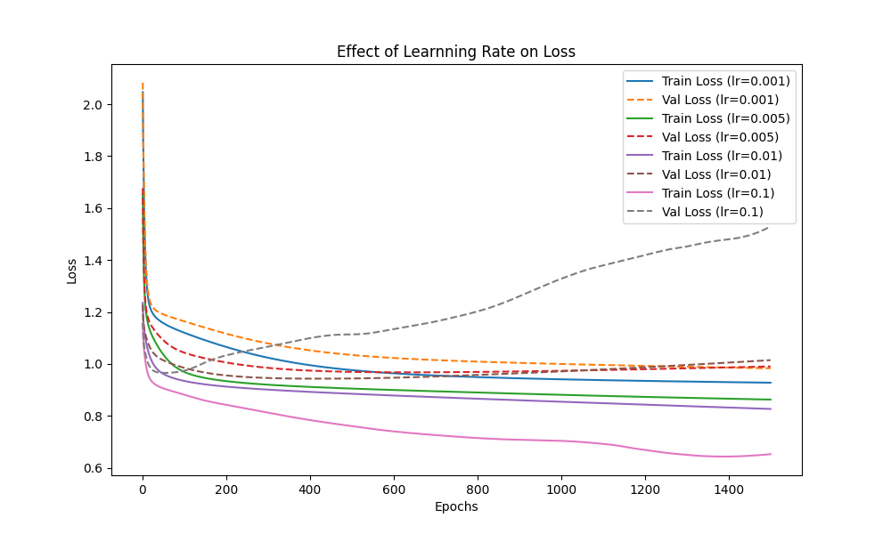
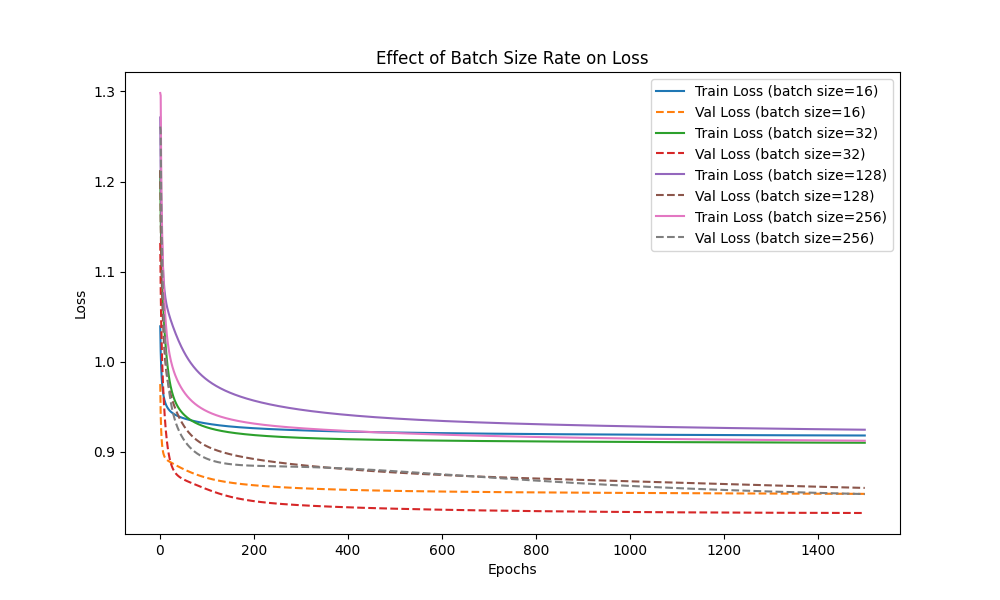
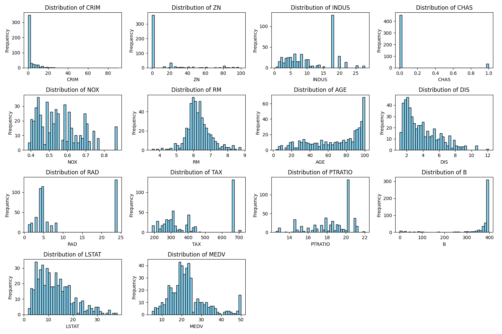
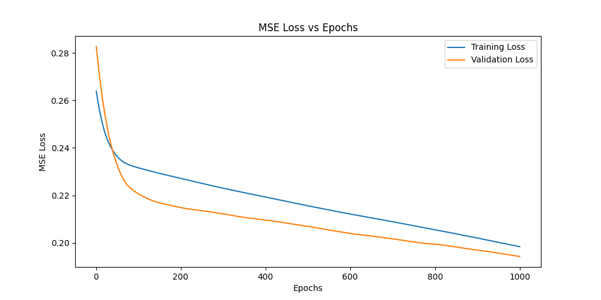
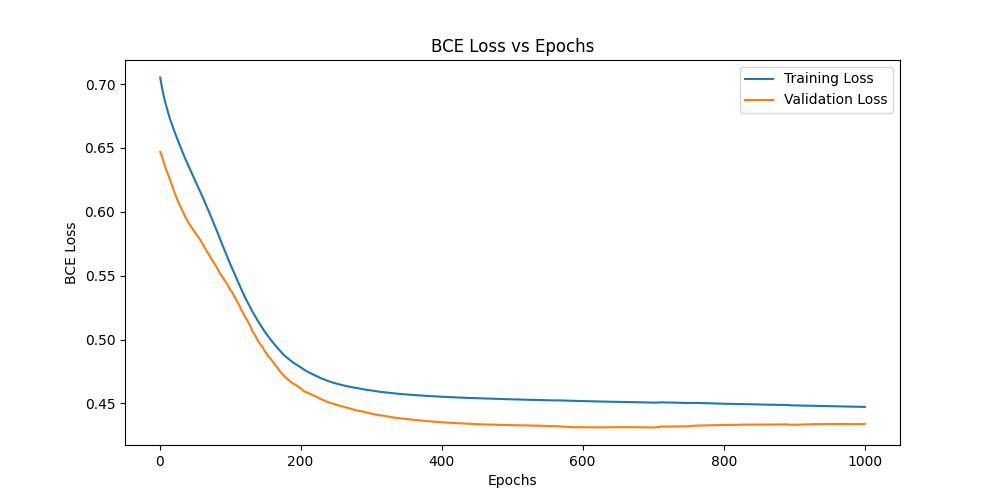
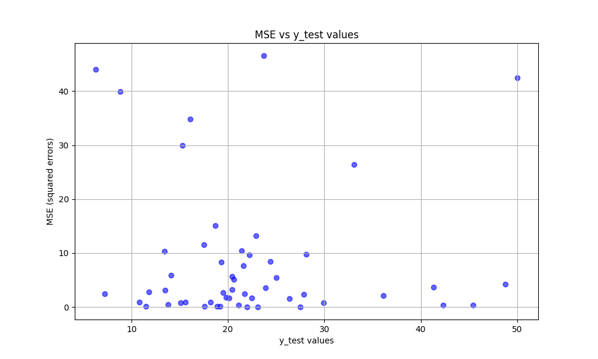

# Assignment-3 Report
## Name : Jayesh Rajesh Sutar
## Roll No. : 2022101001
    
## 2 Multi Layer Perceptron Classification:
### 2.1 Dataset Analysis & Preprocessing
- I performed data analysis for Wine Quality Dataset(WineQT.csv). Following is the description of the dataset using mean, standard deviation, min, and max values for all attributes.

    | Feature                | Mean      | Std Dev   | Min    | Max    |
    |------------------------|-----------|-----------|--------|--------|
    | **Fixed Acidity**       | 8.31      | 1.75      | 4.60   | 15.90  |
    | **Volatile Acidity**    | 0.53      | 0.18      | 0.12   | 1.58   |
    | **Citric Acid**         | 0.27      | 0.20      | 0.00   | 1.00   |
    | **Residual Sugar**      | 2.53      | 1.36      | 0.90   | 15.50  |
    | **Chlorides**           | 0.09      | 0.05      | 0.01   | 0.61   |
    | **Free Sulfur Dioxide** | 15.62     | 10.25     | 1.00   | 68.00  |
    | **Total Sulfur Dioxide**| 45.91     | 32.78     | 6.00   | 289.00 |
    | **Density**             | 0.997     | 0.002     | 0.990  | 1.004  |
    | **pH**                  | 3.31      | 0.16      | 2.74   | 4.01   |
    | **Sulphates**           | 0.66      | 0.17      | 0.33   | 2.00   |
    | **Alcohol**             | 10.44     | 1.08      | 8.40   | 14.90  |
    | **Quality**             | 5.66      | 0.81      | 3.00   | 8.00   |

- following plots represents distribution of different attributes. 
 
Figure : Distribution of Different features in WineQT dataset

### 2.3 Model Training & Hyperparameter Tuning using W&B
- I tuned the model on various hyperparameters on wandb. I performed three sweeps with three different optimizers.
- WandB Link:
    - batch-sweep : [Here](https://wandb.ai/jayesh-sutar/MLPClassifier_hyperparameter_tuning/sweeps/w6e2tr73?nw=nwuserjayeshsutar123456)
    - mini-batch-sweep : [Here](https://wandb.ai/jayesh-sutar/MLPClassifier_hyperparameter_tuning/sweeps/umtiut6c?nw=nwuserjayeshsutar123456)
    - sgd-sweep : [Here](https://wandb.ai/jayesh-sutar/MLPClassifier_hyperparameter_tuning/sweeps/vtomow7g?nw=nwuserjayeshsutar123456)

- following tables shows performance of model on different optimizers.

Table:Model performance with batch optimizer
| Index | hidden_layers | optimizer | batch_size | learning_rate | epochs | activation_function | train_loss | train_accuracy | val_loss | val_accuracy | precision | recall | f1_score |
|-------|---------------|-----------|------------|---------------|--------|---------------------|------------|----------------|----------|--------------|-----------|--------|----------|
| 1     | [64,16]      | batch-gd  | 32         | 0.010         | 2500   | linear              | 0.956      | 0.611          | 0.846    | 0.605        | 0.016     | 0.016  | 0.016    |
| 2     | [64,16]      | batch-gd  | 32         | 0.008         | 2500   | linear              | 0.947      | 0.618          | 0.849    | 0.640        | 0.015     | 0.017  | 0.015    |
| 3     | [64,16]      | batch-gd  | 32         | 0.010         | 2500   | sigmoid             | 1.203      | 0.426          | 1.051    | 0.456        | 0.009     | 0.004  | 0.009    |
| 4     | [64,16]      | batch-gd  | 32         | 0.008         | 2500   | sigmoid             | 1.202      | 0.481          | 1.051    | 0.518        | 0.010     | 0.009  | 0.010    |
| 5     | [64,16]      | batch-gd  | 32         | 0.010         | 2500   | relu                | 0.977      | 0.612          | 0.885    | 0.535        | 0.012     | 0.013  | 0.012    |
| 6     | [64,16]      | batch-gd  | 32         | 0.008         | 2500   | relu                | 1.020      | 0.596          | 0.907    | 0.553        | 0.011     | 0.010  | 0.011    |
| 7     | [64,16]      | batch-gd  | 32         | 0.010         | 2500   | tanh                | 0.957      | 0.618          | 0.840    | 0.605        | 0.014     | 0.017  | 0.014    |
| 8     | [64,16]      | batch-gd  | 32         | 0.008         | 2500   | tanh                | 0.967      | 0.615          | 0.885    | 0.561        | 0.013     | 0.014  | 0.013    |
    

Table:Model performance with mini-batch optimizer   
| Index | hidden_layers | optimizer      | batch_size | learning_rate | epochs | activation_function | train_loss | train_accuracy | val_loss | val_accuracy | precision | recall | f1_score |
|-------|---------------|----------------|------------|---------------|--------|---------------------|------------|----------------|----------|--------------|-----------|--------|----------|
| 1     | [64,16]      | mini-batch-gd  | 64         | 0.01          | 1500   | linear              | 0.8891     | 0.6028         | 0.9814   | 0.6404       | 0.0171    | 0.0156 | 0.0171   |
| 2     | [64,16]      | mini-batch-gd  | 64         | 0.008         | 1500   | linear              | 0.8931     | 0.5996         | 0.9789   | 0.6491       | 0.0173    | 0.0159 | 0.0173   |
| 3     | [64,16]      | mini-batch-gd  | 32         | 0.01          | 1500   | linear              | 0.8856     | 0.5996         | 0.9794   | 0.6316       | 0.0169    | 0.0155 | 0.0169   |
| 4     | [64,16]      | mini-batch-gd  | 32         | 0.008         | 1500   | linear              | 0.8872     | 0.5985         | 0.9706   | 0.6404       | 0.0171    | 0.0158 | 0.0171   |
| 5     | [64,16]      | mini-batch-gd  | 64         | 0.01          | 1500   | sigmoid             | 0.9951     | 0.5733         | 1.0274   | 0.6228       | 0.0138    | 0.0153 | 0.0138   |
| 6     | [64,16]      | mini-batch-gd  | 64         | 0.008         | 1500   | sigmoid             | 1.0280     | 0.5635         | 1.0524   | 0.6053       | 0.0129    | 0.0106 | 0.0129   |
| 7     | [64,16]      | mini-batch-gd  | 32         | 0.01          | 1500   | sigmoid             | 0.9610     | 0.6039         | 0.9871   | 0.6228       | 0.0153    | 0.0148 | 0.0153   |
| 8     | [64,16]      | mini-batch-gd  | 32         | 0.008         | 1500   | sigmoid             | 0.9677     | 0.5919         | 0.9992   | 0.6404       | 0.0156    | 0.0154 | 0.0156   |
| 9     | [64,16]      | mini-batch-gd  | 64         | 0.01          | 1500   | relu                | 0.8354     | 0.6488         | 0.9209   | 0.6667       | 0.0176    | 0.0162 | 0.0176   |
| 10    | [64,16]      | mini-batch-gd  | 64         | 0.008         | 1500   | relu                | 0.8641     | 0.6247         | 0.9228   | 0.6579       | 0.0175    | 0.0160 | 0.0175   |
| 11    | [64,16]      | mini-batch-gd  | 32         | 0.01          | 1500   | relu                | 0.7819     | 0.6652         | 0.9070   | 0.6930       | 0.0192    | 0.0169 | 0.0192   |
| 12    | [64,16]      | mini-batch-gd  | 32         | 0.008         | 1500   | relu                | 0.7815     | 0.6794         | 0.9528   | 0.6579       | 0.0180    | 0.0161 | 0.0180   |
| 13    | [64,16]      | mini-batch-gd  | 64         | 0.01          | 1500   | tanh                | 0.8720     | 0.6160         | 0.9284   | 0.6579       | 0.0175    | 0.0160 | 0.0175   |
| 14    | [64,16]      | mini-batch-gd  | 64         | 0.008         | 1500   | tanh                | 0.8822     | 0.6171         | 0.9622   | 0.6316       | 0.0169    | 0.0155 | 0.0169   |
| 15    | [64,16]      | mini-batch-gd  | 32         | 0.01          | 1500   | tanh                | 0.8382     | 0.6280         | 0.9399   | 0.6667       | 0.0177    | 0.0162 | 0.0177   |
| 16    | [64,16]      | mini-batch-gd  | 32         | 0.008         | 1500   | tanh                | 0.8494     | 0.6357         | 0.9087   | 0.6140       | 0.0165    | 0.0150 | 0.0165   |

Table:Model performance with sgd optimizer 
| Index | Optimizer | Hidden Layers | Batch Size | Learning Rate | Epochs | Activation Function | Train Loss | Train Accuracy | Val Loss | Val Accuracy | Precision | Recall | F1 Score |
|-------|-----------|---------------|------------|---------------|--------|---------------------|------------|----------------|----------|--------------|-----------|--------|----------|
| 1     | sgd       | [64,16]      | 32         | 0.01          | 150    | linear              | 0.9016018  | 0.6203501      | 0.956233 | 0.5964912    | 0.0150    | 0.0144  | 0.0149   |
| 2     | sgd       | [64,16]      | 32         | 0.008         | 150    | linear              | 0.9002616  | 0.6214442      | 0.960118 | 0.5964912    | 0.0150    | 0.0144  | 0.0149   |
| 3     | sgd       | [64,16]      | 32         | 0.01          | 150    | sigmoid             | 0.9337387  | 0.6105033      | 0.931439 | 0.5701754    | 0.0145    | 0.0141  | 0.0143   |
| 4     | sgd       | [64,16]      | 32         | 0.008         | 150    | sigmoid             | 0.9397788  | 0.6214442      | 0.928660 | 0.5964912    | 0.0151    | 0.0148  | 0.0150   |
| 5     | sgd       | [64,16]      | 32         | 0.01          | 150    | relu                | 0.6804066  | 0.7155361      | 1.007462 | 0.5877193    | 0.0154    | 0.0150  | 0.0154   |
| 6     | sgd       | [64,16]      | 32         | 0.008         | 150    | relu                | 0.6939159  | 0.7111597      | 1.046148 | 0.5877193    | 0.0150    | 0.0144  | 0.0150   |
| 7     | sgd       | [64,16]      | 32         | 0.01          | 150    | tanh                | 0.7983443  | 0.6509847      | 1.042942 | 0.5964912    | 0.0154    | 0.0148  | 0.0154   |
| 8     | sgd       | [64,16]      | 32         | 0.008         | 150    | tanh                | 0.7893076  | 0.6663020      | 1.031452 | 0.5877193    | 0.0152    | 0.0143  | 0.0152   |
 
- **Parameter for best Model**:
    - Hidden Layers : 64 x 16
    - Optimizer : mini-batch
    - batch-size : 32
    - Learning rate : 0.008
    - Activation function : tanh
    - Epochs : 1500

### 2.4 Evaluating Single-label Classification Model
- I performed model evaluation using test set and got the following results.      

    Table : Evaluation on Test Dataset
    | Metric              | Macro Score            | Micro Score            |   
    |---------------------|------------------------|    ------------------------|   
    | **Accuracy**         | -                     | 0.6121                |      
    | **Precision**        | 0.0162               | 0.6121                |      
    | **Recall**           | 0.0160               | 0.6121                 |  
    | **F1-Score**         | 0.0162              | 0.6121                 | 

### 2.5 Analyzing Hyperparameters Effects
- **Effect of Non-linearity** : I plot loss v/s epochs for validation and train loss for 4 different activations functions (tanh, sigmoid, relu, linear) while keeping other parameters.    
       
    Figure:Effect of Different of Activation functions  
    - By observing the plot we can see that relu activation performs best followed by tanh activation function. It converges faster compared to other activations.

- **Effect of Learning Rate** : I plot loss v/s epochs for validation and train loss for 4 different values rates while keeping other parameters.  
        
    Figure:Effect of Different of Learning rate 
    - By observing the plot we can see that low learning rate(0.001) tends to converge model slowly.Very high learning rate(0.1) causes rapid decrease in loss but it overshoots the optimal solution results increase in validation losses. A Moderate learning rate(0.01, 0.005) causes better convergence than slow learning rate but also gives us optimal solution. 

- **Effect of Batch Size** : I plot loss v/s epochs for validation and train loss 4 batch sizes with optimizer as mini-batch.   
       
    Figure:Effect of Different of Batch size
    - By observing the plot we can see that small batch size(16) converges faster but overshoots the optimal solution.While the larger batch sizes (128, 256) converges slowly, takes high number of steps. model with batch size = 32 performs best as it converges faster but also reaches the optimal point.

### 2.6 Multi-Label Classification
- I create 'MultiLabelMLP' class for handling mulit-label classification tasks.
- following table summarizes the model results on different hyperparameters

| Index | Optimizer      | Activation Function | Batch Size | Epochs | Hidden Layers | Learning Rate | Train Loss | Val Loss | Train Accuracy | Val Accuracy | Hamming Loss | Precision | Recall | F1 Score |
|-------|----------------|---------------------|------------|--------|---------------|---------------|------------|----------|----------------|--------------|--------------|-----------|--------|----------|
| 1     | mini-batch-gd  | linear              | 64         | 1500   | [64,32]       | 0.01          | 3.7608     | 4.1147   | 0.14125        | 0.14         | 0.22         | 0.878     | 0.382  | 0.532    |
| 2     | mini-batch-gd  | linear              | 64         | 1500   | [64,32]       | 0.001         | 3.8861     | 4.2561   | 0.145          | 0.12         | 0.2275       | 0.844     | 0.385  | 0.529    |
| 3     | mini-batch-gd  | linear              | 16         | 1500   | [64,32]       | 0.01          | 3.7574     | 4.1099   | 0.14           | 0.12         | 0.225        | 0.849     | 0.382  | 0.527    |
| 4     | mini-batch-gd  | linear              | 16         | 1500   | [64,32]       | 0.001         | 3.7548     | 4.1211   | 0.13875        | 0.12         | 0.2225       | 0.864     | 0.382  | 0.530    |
| 5     | mini-batch-gd  | relu                | 64         | 1500   | [64,32]       | 0.01          | 1.0535     | 8.5561   | 0.78125        | 0.04         | 0.3075       | 0.531     | 0.531  | 0.531    |
| 6     | mini-batch-gd  | relu                | 64         | 1500   | [64,32]       | 0.001         | 4.3137     | 4.7425   | 0.09625        | 0.08         | 0.265        | 0.739     | 0.295  | 0.421    |
| 7     | mini-batch-gd  | relu                | 16         | 1500   | [64,32]       | 0.01          | 0.0363     | 25.0819  | 1             | 0.02         | 0.325        | 0.504     | 0.532  | 0.518    |
| 8     | mini-batch-gd  | relu                | 16         | 1500   | [64,32]       | 0.001         | 2.8514     | 4.7461   | 0.26           | 0.03         | 0.28125      | 0.614     | 0.446  | 0.517    |
| 9     | mini-batch-gd  | sigmoid             | 64         | 1500   | [64,32]       | 0.01          | 4.5139     | 4.6942   | 0.085          | 0.11         | 0.2725       | 0.717     | 0.218  | 0.334    |
| 10    | mini-batch-gd  | sigmoid             | 64         | 1500   | [64,32]       | 0.001         | 5.1155     | 5.0695   | 0             | 0            | 0.33         | 0         | 0      | 0        |
| 11    | mini-batch-gd  | sigmoid             | 16         | 1500   | [64,32]       | 0.01          | 3.3384     | 4.2981   | 0.16125        | 0.09         | 0.23375      | 0.778     | 0.399  | 0.528    |
| 12    | mini-batch-gd  | sigmoid             | 16         | 1500   | [64,32]       | 0.001         | 5.0264     | 5.0524   | 0             | 0            | 0.33         | 0         | 0      | 0        |
| 13    | mini-batch-gd  | tanh                | 64         | 1500   | [64,32]       | 0.01          | 1.2291     | 6.3865   | 0.7525         | 0.03         | 0.29875      | 0.552     | 0.497  | 0.523    |
| 14    | mini-batch-gd  | tanh                | 64         | 1500   | [64,32]       | 0.001         | 4.0558     | 4.3703   | 0.12625        | 0.09         | 0.23375      | 0.774     | 0.394  | 0.522    |
| 15    | mini-batch-gd  | tanh                | 16         | 1500   | [64,32]       | 0.01          | 0.0726     | 14.2188  | 1             | 0.01         | 0.33375      | 0.505     | 0.515  | 0.510    |
| 16    | mini-batch-gd  | tanh                | 16         | 1500   | [64,32]       | 0.001         | 3.0800     | 4.4206   | 0.21875        | 0.1          | 0.2525       | 0.691     | 0.427  | 0.528    |

- **Evaluation On Test Set**
    - I run the model test set and got following results. 

        Table : Evaluation on Test Dataset
        | Metric              | Macro Score            | Micro Score            |   
        |---------------------|------------------------|    ------------------------|   
        | **Accuracy**         | -                     | 0.1323                |      
        | **Precision**        | 0.7799               | 0.2380                |      
        | **Recall**           | 0.3769               | 0.1176                 |  
        | **F1-Score**         | 0.5082              | 0.1574                 | 
        | **Hamming Loss**         | -                    |  0.2621            | 

### 2.7 Analysis
- For predictions on test dataset i count the frequency of correct predicted labels.

    Table : Frequency Distribution of correct predictions
    | label | freqeuncy | 
    |-------|-----------|
    |  3   |   0 |
    |  4   |   0 |
    |  5   |   29 |
    |  6   | 27   |
    |  7   | 6   |
    |  8   | 0   |

- From this we can see that classes 5,6,7 are only corrected classified classes.This is because 5,6,7 are most frequent classes present in dataset and so these classes have better distribution in train set which result in their correct classification.

## 3 Multilayer Perceptron Regression   
### 3.1 Data Preprocessing
- I have performed data analysis for Boston Housing Dataset(HousingData.csv). Following is the description of the dataset using mean, standard deviation, min, and max values for all attributes.

    | Feature                | Mean      | Std Dev   | Min      | Max      |
    |------------------------|-----------|-----------|----------|----------|
    | **CRIM**               | 3.61      | 8.72      | 0.006    | 88.98    |
    | **ZN**                 | 11.21     | 23.39     | 0.00     | 100.00   |
    | **INDUS**              | 11.08     | 6.84      | 0.46     | 27.74    |
    | **CHAS**               | 0.07      | 0.26      | 0.00     | 1.00     |
    | **NOX**                | 0.55      | 0.12      | 0.39     | 0.87     |
    | **RM**                 | 6.28      | 0.70      | 3.56     | 8.78     |
    | **AGE**                | 68.52     | 28.00     | 2.90     | 100.00   |
    | **DIS**                | 3.80      | 2.11      | 1.13     | 12.13    |
    | **RAD**                | 9.55      | 8.71      | 1.00     | 24.00    |
    | **TAX**                | 408.24    | 168.54    | 187.00   | 711.00   |
    | **PTRATIO**            | 18.46     | 2.16      | 12.60    | 22.00    |
    | **B**                  | 356.67    | 91.29     | 0.32     | 396.90   |
    | **LSTAT**              | 12.72     | 7.16      | 1.73     | 37.97    |
    | **MEDV**               | 22.53     | 9.20      | 5.00     | 50.00    |

- Following plot represents distribution of different attributes. 
 
Figure : Distribution of Different features in Housing Dataset      
### 3.3 Model Training & Hyperparameter Tuning using W&B    
- I tuned the model for various hyperparamter. I run three sweeps for three optimizers.
- WandB Link:
    - batch-sweep : [Here](https://wandb.ai/jayesh-sutar/MLPRegression_hyperparameter_tuning/sweeps/p1qt7861)
    - mini-batch-sweep : [Here](https://wandb.ai/jayesh-sutar/MLPRegression_hyperparameter_tuning/sweeps/clwq5xw3)
    - sgd-sweep : [Here](https://wandb.ai/jayesh-sutar/MLPRegression_hyperparameter_tuning/sweeps/e7sx39qa)

Table : Model performance on sgd optimizer  
| Index | Optimizer | Batch Size | Activation Function | Epochs | Hidden Layers | Learning Rate | Train Loss | Val Loss | MAE    | RMSE   | R_squared |
|-------|-----------|------------|---------------------|--------|---------------|---------------|------------|----------|--------|--------|-----------|
| 1     | sgd       | 32         | tanh                | 150    | [64,16]       | 0.005         | 19.05      | 18.60    | 3.02   | 4.31   | 0.7767    |
| 2     | sgd       | 32         | tanh                | 150    | [64,16]       | 0.001         | 6.75       | 10.11    | 2.53   | 3.18   | 0.8787    |
| 3     | sgd       | 32         | sigmoid             | 150    | [64,16]       | 0.005         | 7.77       | 9.12     | 2.25   | 3.02   | 0.8905    |
| 4     | sgd       | 32         | sigmoid             | 150    | [64,16]       | 0.001         | 12.59      | 9.70     | 2.41   | 3.11   | 0.8836    |
| 5     | sgd       | 32         | relu                | 150    | [64,16]       | 0.005         | 19.66      | 17.97    | 3.34   | 4.24   | 0.7843    |
| 6     | sgd       | 32         | relu                | 150    | [64,16]       | 0.001         | 8.92       | 10.03    | 2.57   | 3.17   | 0.8796    |

Table : Model performance on mini-batch optimizer   
| Index | Optimizer       | Batch Size | Activation Function | Epochs | Hidden Layers | Learning Rate | Train Loss | Val Loss  | MAE    | RMSE   | R_squared |
|-------|-----------------|------------|---------------------|--------|---------------|---------------|------------|-----------|--------|--------|-----------|
| 1     | mini-batch-gd   | 128        | tanh                | 1500   | [64,16]       | 0.005         | 5.18       | 9.18      | 2.15   | 3.03   | 0.9099    |
| 2     | mini-batch-gd   | 128        | tanh                | 1500   | [64,16]       | 0.001         | 12.56      | 9.08      | 2.19   | 3.01   | 0.9109    |
| 3     | mini-batch-gd   | 32         | tanh                | 1500   | [64,16]       | 0.005         | 2.25       | 10.35     | 2.16   | 3.22   | 0.8984    |
| 4     | mini-batch-gd   | 32         | tanh                | 1500   | [64,16]       | 0.001         | 5.77       | 9.42      | 2.30   | 3.07   | 0.9075    |
| 5     | mini-batch-gd   | 128        | linear              | 1500   | [64,16]       | 0.005         | 24.13      | 17.62     | 2.99   | 4.20   | 0.8270    |
| 6     | mini-batch-gd   | 128        | linear              | 1500   | [64,16]       | 0.001         | 23.76      | 16.86     | 2.97   | 4.11   | 0.8345    |
| 7     | mini-batch-gd   | 32         | linear              | 1500   | [64,16]       | 0.005         | 23.52      | 15.86     | 2.92   | 3.98   | 0.8443    |
| 8     | mini-batch-gd   | 32         | linear              | 1500   | [64,16]       | 0.001         | 23.48      | 15.81     | 2.93   | 3.98   | 0.8448    |
| 9     | mini-batch-gd   | 128        | sigmoid             | 1500   | [64,16]       | 0.005         | 16.30      | 8.13      | 2.22   | 2.85   | 0.9202    |
| 10    | mini-batch-gd   | 128        | sigmoid             | 1500   | [64,16]       | 0.001         | 26.06      | 26.52     | 3.53   | 5.15   | 0.7396    |
| 11    | mini-batch-gd   | 32         | sigmoid             | 1500   | [64,16]       | 0.005         | 9.18       | 7.67      | 2.19   | 2.77   | 0.9247    |
| 12    | mini-batch-gd   | 32         | sigmoid             | 1500   | [64,16]       | 0.001         | 17.14      | 8.50      | 2.32   | 2.92   | 0.9165    |
| 13    | mini-batch-gd   | 128        | relu                | 1500   | [64,16]       | 0.005         | 6.12       | 6.21      | 1.74   | 2.49   | 0.9391    |
| 14    | mini-batch-gd   | 128        | relu                | 1500   | [64,16]       | 0.001         | 11.71      | 7.78      | 2.05   | 2.79   | 0.9236    |
| 15    | mini-batch-gd   | 32         | relu                | 1500   | [64,16]       | 0.005         | 2.75       | 10.99     | 2.27   | 3.32   | 0.8921    |
| 16    | mini-batch-gd   | 32         | relu                | 1500   | [64,16]       | 0.001         | 6.39       | 7.19      | 1.93   | 2.68   | 0.9294    |

Table : Model performance on batch optimizer    
| Index | optimizer | batch_size | activation_function | epochs | hidden_layers | learning_rate | train_loss | val_loss | MAE   | RMSE  | R_squared |
|-------|-----------|------------|---------------------|--------|---------------|---------------|------------|----------|-------|--------|-----------|
| 1     | batch-gd  | 128        | tanh                | 2500   | [64,16]       | 0.005         | 7.454      | 40.258   | 3.202 | 6.345  | 0.574     |
| 2     | batch-gd  | 128        | tanh                | 2500   | [64,16]       | 0.001         | 13.984     | 42.162   | 3.419 | 6.493  | 0.553     |
| 3     | batch-gd  | 128        | linear              | 2500   | [64,16]       | 0.005         | 21.013     | 46.698   | 3.748 | 6.834  | 0.505     |
| 4     | batch-gd  | 128        | linear              | 2500   | [64,16]       | 0.001         | 21.152     | 48.509   | 3.780 | 6.965  | 0.486     |
| 5     | batch-gd  | 128        | sigmoid             | 2500   | [64,16]       | 0.005         | 15.499     | 41.817   | 3.460 | 6.467  | 0.557     |
| 6     | batch-gd  | 128        | sigmoid             | 2500   | [64,16]       | 0.001         | 58.959     | 77.674   | 5.471 | 8.813  | 0.177     |
| 7     | batch-gd  | 128        | relu                | 2500   | [64,16]       | 0.005         | 9.236      | 37.037   | 3.517 | 6.086  | 0.608     |
| 8     | batch-gd  | 128        | relu                | 2500   | [64,16]       | 0.001         | 13.911     | 42.663   | 3.430 | 6.532  | 0.548     |

- **Parameter for best model**:
    - Hidden Layers : 64 x 16
    - Optimizer : mini-batch
    - batch-size : 128
    - Learning rate : 0.005
    - Activation function : relu
    - Epochs : 1500

### 3.4 Evaluating Model
- I run the model on test set and got the following results:    

    Table: Model Evalution On Test Set
    | Metric        | Value       |
    |---------------|-------------|
    | **MSE**       | 5.7963      |
    | **MAE**       | 1.9953      |
    | **RMSE**      | 2.4076      |
    | **R-Squared** | 0.8845      |

### 3.5 Mean Squared Error vs Binary Cross Entropy 
- I run MLP Regression model with sigmoid activation on last layer for two loss functions, MSE and BCE. 
- I plot the loss v/s epoch using MSE and BCE losses.

  
Figure : Loss v/s Epochs (MSE loss)

  
Figure : Loss v/s Epochs (MSE loss) 

- We can observe that BCE loss converges faster as compared to MSE loss. This is because BCE is designed for binary classification. it directly penalizes incorrect class probablities, making it more efficient in lesser steps.
- except first few epochs, MSE converges slowly as it is better suited for regression tasks.it doesn't handle probability as effectively.

### 3.6 Analysis    
- I plot the MSE for each point in test data.   
      
Figure:MSE Distribution     
- We can observe that point lying in range 18-25 hase low mse as compared to other points.
- These points lying outside the range 18-25 can be outliers.other reason can be that in given dataset the target variable(MEDV) has higher frequency in range 18-25.So points in this range have a better representation in training dataset.

## 4 AutoEncoders 
### 4.1 AutoEncoder Implementation from scratch  
- I implemented autoencoder using MLP Regression class which reduces dataset to given number of dimensions and reconstructs it back to the original vector.    
### 4.3 AutoEncoder + KNN   
- I use the autoencoder to reduced spotify dataset dimensions.orginal dataset has 15 features I reduced it to 12 features.     
- **KNN on Reduced Dataset**:   
    - I run the knn model with k=11 and distance Method as manhattan on reduced dataset.I got the following results. 

        Table : KNN on reduced Dataset (with autoencoder)
        | Metric              | Macro Score            | Micro Score            |   
        |---------------------|------------------------|    ------------------------|   
        | **Accuracy**         | -          |      0.2134     |      
        | **Precision**        |  0.0012    |    0.2134       |      
        | **Recall**           | 0.0012      | 0.2134       |  
        | **F1-Score**         | 0.0012       | 0.2134       | 

        Table : KNN on Reduced Dataset (with PCA)  
        | Metric              | Macro Score            | Micro Score            |   
        |---------------------|------------------------|    ------------------------|   
        | **Accuracy**         | -                     | 0.2817                 |      
        | **Precision**        | 0.0017                 | 0.2817                 |      
        | **Recall**           | 0.0016                 | 0.2817                 |  
        | **F1-Score**         | 0.0017                 | 0.2817                 | 

        Table : KNN on complete Dataset
        | Metric              | Macro Score            | Micro Score            |   
        |---------------------|------------------------|    ------------------------|   
        | **Accuracy**         | -                     | 0.3184                 |      
        | **Precision**        | 0.0018                 | 0.3184                 |      
        | **Recall**           | 0.0018                 | 0.3184                 |  
        | **F1-Score**         | 0.0018                 | 0.3184                 |
    - By comparing the results of KNN on reduced dataset using PCA and KNN on reduced dataset using autoencoder with PCA it gives better results as compared to autoencoder.
    - The can be due to the fact that PCA applies linear transformation on dataset while autoencoder applies non-linear complex     transformations.since kNN is distance based algorithm it can be  less effective on dataset reduced by autoencoder as distance b/w points may no longer represent meaningfull relationship.

- **MLP Classification on Reduced Dataset**: 
    - I run the MLP classifier on reduced dataset.I got the following results:
        Table : MLP on complete Dataset
        | Metric              | Macro Score            | Micro Score            |   
        |---------------------|------------------------|    ------------------------|   
        | **Accuracy**         | -                     | 0.2551                 |      
        | **Precision**        | 0.0014                 | 0.2551                 |      
        | **Recall**           | 0.0013                 | 0.2551                 |  
        | **F1-Score**         | 0.0014                 | 0.2551                 | 

