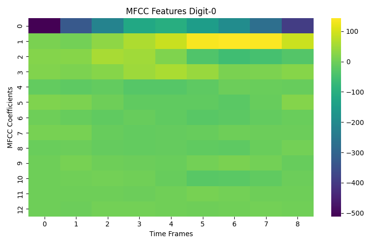

# Assignment-5 Report
#### Name : Jayesh Rajesh Sutar
#### Roll No. : 2022101001
    
## 2 Kernel Density Estimation:
### 2.1 Task 1: KDE Class
- I have Implemented KDE class with given requirements.
- The corresponding code is located in *kde_model.py*

### 2.2 Task 2: Generate Synthetic Data
- I have generated the required dataset of 3500 points uniformly and randomly.
- Following plot shows the dataset distribution.    

     

  Figure:Synthetic Dataset Distribution       

  ### 2.3 Task 3: KDE vs GMM
  - I tried both KDE and GMM model on above dataset. Following plots shows how KDE and GMM(with two components) fit the above dataset

     

  Figure:KDE on Synthetic Dataset 

       

  Figure:GMM on Synthetic Dataset    

  - I also tried GMM model with high number of components. I plotted the results for number of components equal to 5 and 10 respectively.

     

  Figure:GMM on Synthetic Dataset (number of components=5)    

    
   
  Figure:GMM on Synthetic Dataset (number of components=10)    

- For GMM with 2 components, we can see that model identifies two distinct clusters - a small dense cluster and a larger more spreaded sparser cluster.
- With GMM as we increase the number of components we can see more than one cluster in areas of similar density.This is because with higher number of components GMM tries to fit local variation. 
- The KDE model appears to consistently fit the data well as we can see the higher densities near the dense distribution. Also in the sparse distribution of data the densities are low so overall the KDE plot is consistent with the actual distribution.

## 3 Hidden Markov Models
### 3.2 Dataset
- Using librosa library I extracted the MFCC features from digits audio files. I visualized the MFCC features as a heatmap. Following plots shows these heatmaps for each digit.
  

    
    
    
    
    
    
    
    
    
    
  

- From these plots distinct temporal progression from left to right in the MFCC feature values with time. For ex. Digit 0 shows strong features in the first coefficients that evolve over 8 frames, Digit 1 shows more compact pattern over ~5 frames and similarly for other digits.
- Since HMMs are designed to model such sequetial data where the current state depends on previous states. The MFCC patterns shows such sequetial progression. Hence HMMs are suitable for this task.

### 3.4 Metrics
- I test the above model on test set and got **94.63%** accuracy
- I also test this model on my personal recordings of digts and got following predictions for each digit. 

  Table:Model Predictions on Personal Recordings
  |  Actual | Predicted | 
  |---------|-----------|
  |   0     |    0      |
  |   1     |    4      |
  |   2     |    4      |
  |   3     |    4      |
  |   4     |    4      |
  |   5     |    1      |
  |   6     |    4      |
  |   7     |    4      |
  |   8     |    1      |
  |   9     |    4      | 

- Overall I got the accuracy of 20% on personal recordings. 
- This model is performing better on test dataset as compared to personal recordings. This can be due to noise present in personal recordings.

## 4 Recurrent Neural Networks
### 4.1 Counting Bits
#### 4.1.1 Task 1: Dataset
- I construct a dataset of 100k sequences of random bits with lengths varying from 1 to 16, where each sequence is paired with a label indicating the count of 1's in the sequence. 
- I split this dataset in training, validation, and test split with ratios (0.8, 0.1, 0.1). 

#### 4.1.2 Task 2: Architecture 
- I Implemented RNN based model to count number of 1's in given binary sequence. The corresponding code is located in *bit_counting_model.py*. 

#### 4.1.3 Task 3: Training 
- I trained the above model on dataset generated in 4.1.1. 
- I used MAE as evaluation metric. I evaluated this model on test set got the following results. 
    - **MAE on Test Set** : 0.0281
- I computed random baseline results on test set 
    - **MAE with Random Baseline** : 3.7934

#### 4.1.4 Task 4: Generalization 
- I tried to generalize this model on large sequence of length 17, 18 etc. Following plot shows MAEs for sequences with length from 1 to 32.  

       
  Figure:Sequence Length v/s MAE  

- We can see that MAE relatively low sequences of length less that 17 after that the MAE is increasing rapidly. 
- This is because We trained the model on sequences of length 1 to 16 So model performs well on these sequences but for larger sequences(17 to 32) it struggles because it was not exposed to these sequences during training. 

### 4.2 Optical Character Recognition 
#### 4.2.1 Task 1: Dataset
- I constructed the required word images dataset using nltk library. Following are some rendered samples. 

  

    
    
    
    
  

#### 4.2.2 Task 2: Architecture 
- I built OCR model using both CNN and RNN, where the encoder is based on CNN and decoder is based on RNN.
- The corresponding code is located in *ocr_model.py*.

#### 4.2.3 Task 3: Training
- I trained the OCR model on dataset constructed in 4.2.1.
- I used *Average Number of Correct Characters(ANCC)* as evaluation metrices. Following are the results after training the model for 10 epochs with adam optimizer and learning rate of 0.001.
  - **ANCC On Validation Set** : 0.9537
  - **ANCC with Random Baseline** : 0.0378
- By comparing the random baseline results we can say that OCR model is performing much better.
- Following are actual v/s predicted words using final trained model.

  Table:OCR model results
  |  Actual Word | Predicted Word | 
  |--------------|----------------|
  | deoppilative |   deoppilative |
  | idiopathic   |   idiopathic   |
  | undefinableness   |   undefinableness   |
  | palaeesthnologip   |  palaeoethnologic   |
  | palaeesthnologip   |  palaeoethnologic   |
  | Colosseum   |  Colosseum   |

